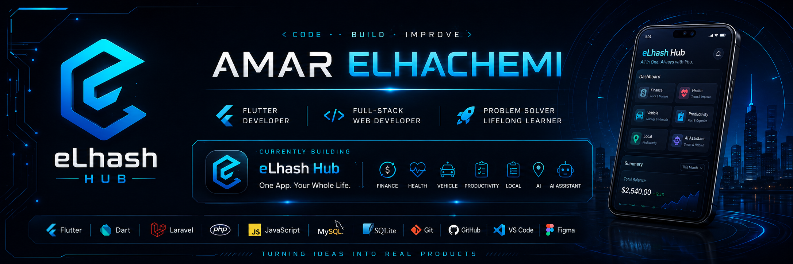

<p align="center">
  
</p>

<h1 align="center">Hi 👋 I'm Amar Elhachemi Cherki</h1>

<h3 align="center">
Flutter Developer • Full-Stack Web Developer • Building Products That Solve Real Problems
</h3>

<p align="center">

🇩🇿 Algeria • 📱 Creator of <strong>eLhash Hub</strong>

</p>

---

# 🚀 Currently Building

## 📱 eLhash Hub

> **One App. Your Whole Life.**

A modern Flutter application designed to combine multiple everyday tools into one beautiful experience.

### Modules

- 💰 Finance
- ❤️ Health
- 🚗 Vehicle
- 📝 Productivity
- 📍 Local
- 🤖 AI Assistant
- ⚙️ Settings
- ☁️ Cloud Sync

---

# 📊 Development Progress

```
████████░░░░░░░░░░░░ 20%

Current Version
v0.2 Alpha

Current Milestone

🏃 Health Module
```

---

# 🌐 Live Projects

| Project | Live Demo |
|---------|-----------|
| 🌍 Portfolio | https://amar-elhachemi.github.io/portfolio/ |
| 💼 Portfolio Websites | https://amar-elhachemi.github.io/portfolio-websites/ |
| 🎮 CS2 Crosshair Generator | https://amar-elhachemi.github.io/cs2-crosshair-generator/ |
| 🚀 Impossible Landing | https://amar-elhachemi.github.io/landing-page/ |

---

# 💻 Tech Stack

### Mobile

<p>


</p>

### Backend

<p>


</p>

### Frontend

<p>


</p>

### Database

<p>


</p>

### Tools

<p>


</p>

---

# 📌 Featured Repositories

⭐ eLhash Hub

📱 Modern life management application built with Flutter.

⭐ Portfolio

🌍 Personal developer portfolio.

⭐ Portfolio Websites

💼 Landing pages for local businesses.

⭐ CS2 Crosshair Generator

🎯 Utility for Counter-Strike 2 players.

---

# 🎯 2026 Goals

- ✅ Build eLhash Hub
- 🔄 Publish on Google Play
- 💻 Windows Desktop Version
- 🌐 Web Version
- 🤖 AI Integration
- 📈 30+ Quality GitHub Repositories

---

# 📈 GitHub Statistics

<p align="center">


</p>

---

# 🔥 Contribution Graph

<p align="center">


</p>

---

# 📬 Connect With Me

🌍 Portfolio

https://amar-elhachemi.github.io/portfolio/

💼 LinkedIn

https://linkedin.com/in/amarelhachemicherki

📧 Email

amar.elhachemi.cherki@gmail.com

---

<p align="center">

<i>Always building something new 🚀</i>

</p>